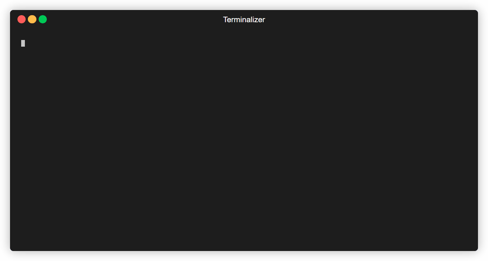

# reqhound 🐾

> Track what your Python script **actually imports at runtime**, not what's installed.




---

## The problem

`pip freeze` dumps every package installed in your environment; often 50+ packages when your project uses 5. Reqhound watches your script at runtime and captures only what it actually imports.

---

## Install

```bash
pip install reqhound
```

---

## Usage

```bash
reqhound run myscript.py   # track imports at runtime
reqhound check             # diff against requirements.txt
reqhound export            # write a clean requirements.txt
```

---

## Example output

```
── reqhound results ──────────────────
    requests
    flask        ← missing from requirements.txt
    numpy        ← in requirements.txt but never imported
──────────────────────────────────────
  1 present  1 missing  1 unused
```

---

## Workflow

**New project — no requirements.txt yet:**
```bash
reqhound run myscript.py
reqhound export            # creates requirements.txt from scratch
```

**Existing project — check for drift:**
```bash
reqhound run myscript.py
reqhound check             # see what's missing or unused
```

---

## Why not pip freeze?

| | `pip freeze` | `reqhound` |
|---|---|---|
| Source | everything installed | runtime imports only |
| Accuracy | over-reports | exact |
| Sub-dependencies | included | excluded |
| New projects | requires venv | works anywhere |

---

Thank You !
